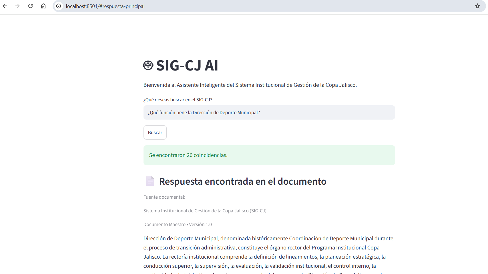
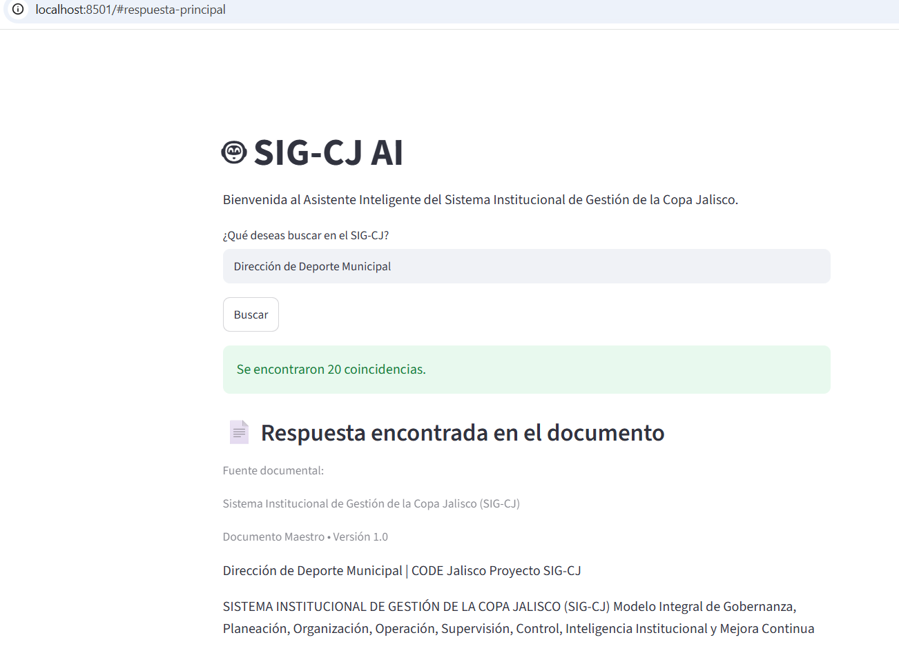
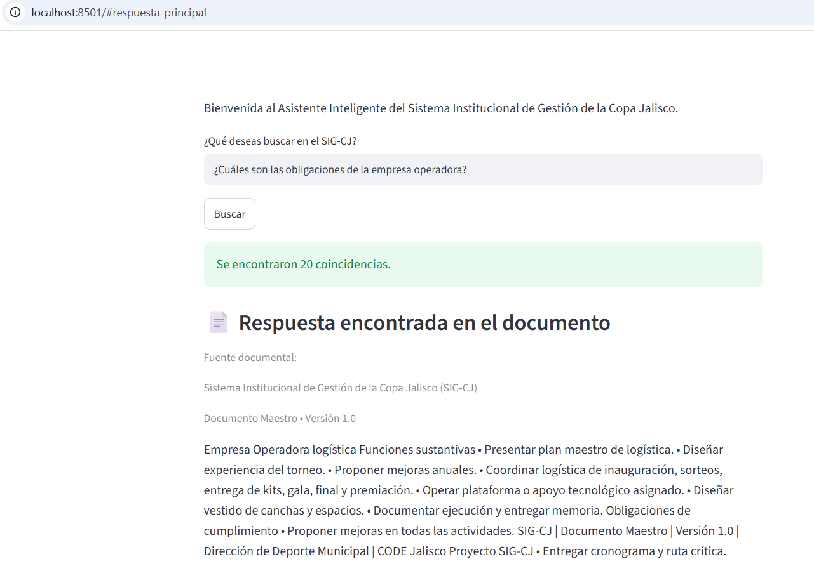
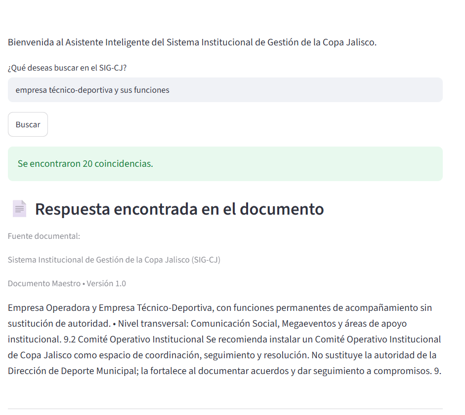

# 🤖 SIG-CJ AI

## Asistente Inteligente para la consulta del Sistema Institucional de Gestión de la Copa Jalisco

Proyecto desarrollado como parte del **Challenge ONE – Oracle Next Education (Alura Latam)**.

---

## 📖 Descripción

SIG-CJ AI es un asistente inteligente desarrollado en Python con Streamlit que permite consultar información contenida en el Documento Maestro del Sistema Institucional de Gestión de la Copa Jalisco.

El proyecto demuestra cómo la Inteligencia Artificial puede facilitar la consulta de documentos institucionales mediante un motor de búsqueda por palabras clave, presentando al usuario la respuesta más relevante encontrada en el documento y mostrando otras coincidencias relacionadas junto con su fuente documental.

Su propósito es reducir significativamente el tiempo necesario para localizar información institucional, fortaleciendo la gestión documental y la toma de decisiones.
---

## 🎯 Objetivo del proyecto

Desarrollar un asistente inteligente capaz de responder consultas basadas en el Documento Maestro del Sistema Institucional de Gestión de la Copa Jalisco (SIG-CJ), permitiendo localizar información institucional de manera rápida, organizada y comprensible mediante una aplicación web desarrollada con Python y Streamlit.

El proyecto busca demostrar la aplicación práctica de técnicas de búsqueda documental apoyadas por Inteligencia Artificial para fortalecer la gestión del conocimiento dentro de una institución pública.
---

## ✨ Funcionalidades

- Consulta de información contenida en un documento PDF institucional.
- Procesamiento automático del Documento Maestro SIG-CJ.
- Identificación de palabras clave dentro de la consulta realizada por el usuario.
- Clasificación de coincidencias mediante un sistema de puntuación.
- Presentación automática del fragmento documental con mayor puntuación.
- Visualización de otras coincidencias relacionadas.
- Referencia permanente a la fuente documental utilizada.
- Interfaz web intuitiva desarrollada con Streamlit.
---

## 🛠 Tecnologías utilizadas

- Python 3
- Streamlit
- PyMuPDF (fitz)
- Git
- GitHub
- Visual Studio Code
- Markdown
---

## 🏗 Arquitectura de la solución

```text
                Usuario
                    │
                    ▼
        Aplicación Web (Streamlit)
                    │
                    ▼
        Motor de búsqueda por palabras clave
                    │
                    ▼
 Procesamiento del Documento PDF (SIG-CJ)
                    │
                    ▼
      Clasificación de Coincidencias
                    │
                    ▼
      Respuesta presentada al usuario
---

## 📁 Estructura del proyecto

```text
04 Código/
│
├── documentos/
│   └── SIG-CJ.pdf
│
├── src/
│   ├── app.py
│   ├── app_v4.py
│   ├── app_v5.py
│   └── app_v2_respaldo.py
│
├── requirements.txt
└── README.md
```
---

## ⚙️ Instalación del proyecto

### 1. Clonar el repositorio

```bash
git clone https://github.com/AnaRuiz-Gdl/Challenge-Copa-Jalisco.git
```

---

### 2. Entrar al proyecto

```bash
cd Challenge-Copa-Jalisco
```

---

### 3. Crear un entorno virtual

```bash
python -m venv .venv
```

---

### 4. Activar el entorno virtual

#### Windows

```bash
.venv\Scripts\activate
```

#### Linux / macOS

```bash
source .venv/bin/activate
```

---

### 5. Instalar las dependencias

```bash
pip install -r requirements.txt
```

---

### 6. Ejecutar la aplicación

```bash
streamlit run src/app_v5.py
```

---

Una vez iniciada la aplicación, abrir el navegador en:

```text
http://localhost:8501
```
Al iniciar la aplicación se abrirá una interfaz web en el navegador, desde la cual el usuario podrá realizar consultas sobre el Documento Maestro del Sistema Institucional de Gestión de la Copa Jalisco. El sistema identificará la información más relevante relacionada con la consulta y mostrará la respuesta principal, así como otras coincidencias encontradas dentro del documento.
---

---

## 💬 Ejemplos de consultas

A continuación se muestran algunos ejemplos de preguntas que el usuario puede realizar al asistente inteligente:

- ¿Qué función tiene la Dirección de Deporte Municipal?
- ¿Cuáles son las atribuciones de la Empresa Operadora?
- ¿Qué responsabilidades tiene la Empresa Técnico-Deportiva?
- ¿Cómo se integra el Comité de Honor y Justicia?
- ¿Cuáles son los principios rectores del Sistema Institucional de Gestión de la Copa Jalisco?
- ¿Qué obligaciones tienen los municipios participantes?
- ¿Cómo está organizada la estructura institucional de la Copa Jalisco?
- ¿Qué documentos integran el Sistema Institucional de Gestión de la Copa Jalisco?
---

---
## 📸 Interfaz principal

La siguiente imagen muestra la interfaz inicial del asistente SIG-CJ AI, desde la cual el usuario puede realizar consultas sobre el Documento Maestro del Sistema Institucional de Gestión de la Copa Jalisco.



## 🧠 Ejemplos de respuestas

### Ejemplo 1. Consulta sobre la Dirección de Deporte Municipal

**Consulta realizada**

> ¿Qué función tiene la Dirección de Deporte Municipal?

**Resultado obtenido**



---

### Ejemplo 2. Consulta sobre la Empresa Operadora

**Consulta realizada**

> ¿Cuáles son las atribuciones de la Empresa Operadora?

**Resultado obtenido**



---

### Ejemplo 3. Consulta sobre la Empresa Técnico-Deportiva

**Consulta realizada**

> ¿Qué responsabilidades tiene la Empresa Técnico-Deportiva?

**Resultado obtenido**



---


## 📈 Evolución del proyecto

| Versión | Descripción |
|---------|-------------|
| 0.1 | Lectura inicial del documento PDF y extracción del contenido. |
| 0.2 | Implementación de búsqueda básica por palabras clave. |
| 0.3 | Incorporación de múltiples coincidencias y selección de resultados. |
| 0.4 | Desarrollo del motor de búsqueda inteligente con clasificación por relevancia. |
| 0.5 | Presentación automática de la respuesta principal, consulta de resultados complementarios y referencia de la fuente documental. |
---

## 👩‍💻 Autora

**Ana Ruiz**

Proyecto desarrollado como parte del Challenge ONE – Oracle Next Education (Alura Latam).

Aplicación diseñada para demostrar el uso de técnicas de Inteligencia Artificial orientadas a la consulta de documentos institucionales.
---

## 🚀 Estado del proyecto

Versión actual: **0.5**

La versión 0.5 representa una versión funcional del asistente documental basado en búsqueda por palabras clave, clasificación de coincidencias y presentación del fragmento más relevante encontrado en el Documento Maestro del SIG-CJ

## 📚 Aprendizajes obtenidos

Durante el desarrollo del proyecto se aplicaron conocimientos relacionados con:

- Procesamiento de documentos PDF.
- Desarrollo de interfaces web con Streamlit.
- Gestión de proyectos mediante Git y GitHub.
- Organización del código fuente.
- Implementación de motores de búsqueda por palabras clave.
- Clasificación de resultados mediante un sistema de puntuación.
- Presentación de respuestas con referencia documental.

## 🔮 Mejoras futuras

- Implementar búsqueda semántica mediante embeddings.
- Incorporar múltiples documentos institucionales.
- Mostrar el número de página donde se encontró la respuesta.
- Resumir automáticamente los resultados.
- Implementar búsqueda mediante Inteligencia Artificial Generativa.
- Desplegar el proyecto en Oracle Cloud Infrastructure (OCI).